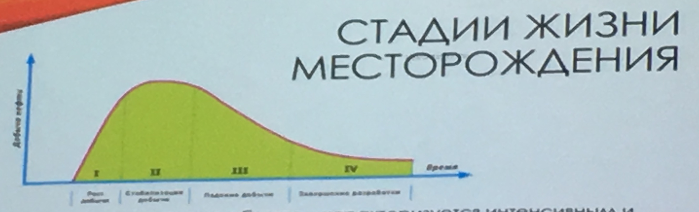
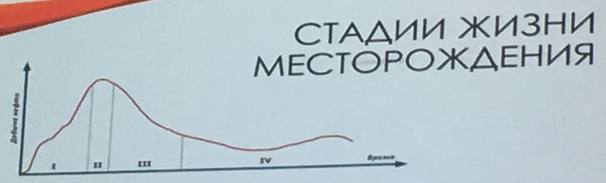

Гидродинамические исследования должны проводиться систематически. 

Есть уравнение Дюпи. Оно описывает радиальный приток флюида к скважине.

Общий вид уравнения: 

$$
Q = K_{пр}*\Delta P = K_{пр} \cdot (P_{пласт}-P_{забойное})\\
Q = \frac{2\pi kh}{\mu b_н} \cdot \frac{P_{пл}-P_{заб}}{\ln(\frac{R_k}{r_c})}
$$

$K_{пр}$ - коэффициент продуктивности
$b_н$ - объёмный коэффициент

**[2]** Чем больше разность плотностей между нефтью и водой, тем более четко выражена граница ВНК. 

Что характеризует пласт:

- Эффективная мощность - это толщина пласта, где находится нефть.
- Радиус коллектора
- Пористость породы
- Проницаемость породы
- Вязкость нефти

### 2. Исследование скважин, дренирующих поровый коллектор, при неустановившемся режиме фильтрации, без учета притока

*26 февраля*

Когда скважина не работает, то в ней держится статический уровень жидкости. Когда работает - динамический уровень. Исследование заключается в остановке скважины и отслеживании процесса восстановления статического уровня из динамического.

Причины искажения (нелинейного вида) КВД (Кривой восстановления давления):

- влияние границ пласта
- нарушение геометрии потоков в призабойной зоне
- продолжающийся после остановки приток жидкости в скважину
- неизотермичность процесса восстановления давления
- нарушение режима работы скважины перед остановкой

Прямолинйеный участок КВД следует выбирать так, чтобы начало участка было не менее $10^{-3}$, а конец - от $10^{-2}$ до $10^{-5}​$

Три группы методов исследования скважин:

- при установившемся режиме работы
- при неустановившемся режиме (по кривым восстановления давления)
- по взаимодействию скважин при однократном возмущении
- при многократном гармоническом возмущении - метод фильтрационно-гармонических волн давления

### 3. Какая-то лекция

*12 марта*

Коэффициент гидропроводности

$$
\Epsilon = \frac{kh}{\mu} [\frac{мкм^2 * см}{мПа * с}]
$$

Коэффициент продуктивности определяет добывные возможности скважин при снижении забойного давления на один мегапаскаль

$$
Kпрод = \frac{Q}{\Delta P} = \frac{2\pi\Epsilon}{\ln(\frac{Rk}{rскв})} \  [\frac{м^3}{сут * МПа}]\\
Q = Kпрод * \Delta P
$$

Коэффициент пьезопроводности пласта характеризует его способность к передаче возмущения (изменения давления по пласту), вызываемых изменениями режима эксплуатации скважины. Чем больше величина пьезопроводности, тем быстрее передается импуль давления по пласту от возмущающей скважины к реагирующей

$$
\chi = \frac{K}{Mн * \beta^*} = \frac{K}{\mu н * (m\betaн + \betaскелета \ породы)}
$$

##### Пример по методу касательных

Дано:
$$
Qн = 124т/сут\\
Pз = 134.5ат = 13.45 МПа \\
h = 10м \\
m = 0.2 \\
\betaн = 11*10^{-5} \ 1/ат \\
\betaс = 1 * 10^{-5} \ 1/ат \\
b = 1.16 \\
\mu н = 2.6 \ сП \\
\rho н = 0.86 г/см^3 \\
l = 400м
$$

| Время суток | t,с  | lg t | $\Delta P( t )$, ат |
| ----------- | ---- | ---- | ------------------- |
| 9:30        | 0    | 0    | 0                   |
| 9:33        | 180  | 2.26 | 1.0                 |
| 9:36        | 360  | 2.56 | 2.8                 |

$\Delta P(t)$ - изменение давления на забое скважины после ее остановки

**(картинка 190312-1)**

Методом касательных можно определить только комплексный параметр и гидропроводность.
$$
\chi = \frac{K * \frac{h}{\mu}}{\mu * (m \beta н + \beta ск) * \frac{h}{\mu}} = \frac{81}{1000 (0.2*11 + 1) 10^{-5}} = 2531 \frac{см^2}{с} \\

rс \ пр = \sqrt{\frac{\chi}{\frac{10^{\frac{B}{i}}}{2.25}}} = \sqrt{\frac{2531}{3.1}} = 28.5 см \\

K = \frac{q}{Pпл - Pс} = \frac{\frac{2\pi k h}{\mu}}{2.3 \ln(\frac{Rк}{rспр})} = 2.3 \\
$$

### Лекция

*19 марта*

**Управление разработкой нефтяных и газовых месторождений** - это прежде всего выработка решений по всему комплексу проводимых на месторождении работ - методов определения, контроля, поддержания оптимального технологического, экологического и экономического режима, максимально соответствующих проектным показателям.

Основная цель управления разработкой месторождений - максимизация экономической эффективности его эксплуатации на протяжении всего жизненного цикла (поиск, разведка, разработка, подготовка, переработка и сбыт) и получения ее оптимального варианта с наилучшим соотношением технико-экономических показателей.

**Стадия** - это этап разработки месторождения природного ископаемого с закономерными изменениями технологических процессов. Во время одного периода технико-экономические показатели не изменяются.

*Рост добычи - Стабилизация добычи - Падение добычи - Завершение разработки*

1. Первая стадия - освоение эксплуатационного объекта - характеризуется интенсивынм и постоянным ростом добычи природного ресурса до максимального уровня, ростом действующего фонда скважин и резким падением пластового давления. Как правило, на этой стадии обводненность сырья достигает 3-4%. Длительность периода зависит от ценности залежей.

2. Вторая стадия - постоянная добыла полечного ископаемого, поддержание стабильного высокого его уровня. Характерные особенности:

- увеличение количества буровых
- прирост обводненности сырья
- отключение незначительной части скважин из-за существенного обводнения (до 98%)

**Коэффициент извлечения нефти** - отношение величины извлекаемых запасов к величине геологических запасов

3. Третья стадия - сниженеи добычи нефти. Для нее характерны резкое снижение темпов отбора количества добытого природного ресурса, существенное уменьшение функционирующих скважин из-за постоянного роста обводнения продукции. В это же время разработка переводится на механизированный способ добычи.
4. Четвертая стадия - завершающая. Для нее характерны малые темпы добычи нефти, большая обводненность, еще более резкое уменьшение количества работающих скважин. Продолжительность завершающей стадии сопоставима со всеми предыдущими. Применяют методы увеличения нефтеотдачи (МУНы).

Виды остаточной нефтенасыщенности:

- капиллярно-защемленная
- адсорбированная (из-за гидрофильности/гидрофобности породы)
- пленочная
- остаточная нефтенасыщенность тупиковых пор и микронеоднородностей
- практическая, обусловленная неустойчивостью вытеснения на микро и макроуровне